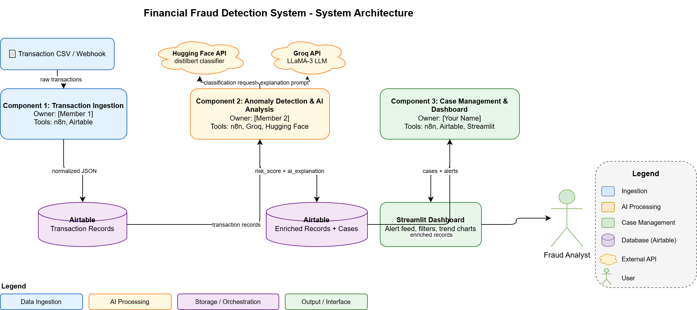

# Financial Fraud Detection System

## Team Members
| Name           | Role/Component                   | GitHub Username |
|----------------|----------------------------------|-----------------|
| Ergi Sula      | Transaction Ingestion            | @ErgiS13        |
| Thomas Kamel   | Anomaly Detection & AI Analysis  | @thomaskamel    |
| Andrew Skoblov | Case Management & Dashboard      | @andrewskoblov  |

## Problem Statement
Financial institutions process thousands of transactions daily, making it impossible for analysts to manually review each one for fraudulent activity. Current rule-based systems generate excessive false positives and lack the ability to explain why a transaction was flagged. This project builds an AI-powered pipeline that automatically detects anomalous transactions, generates human-readable explanations, and surfaces them in a prioritized investigation dashboard.

## Target Users
Fraud analysts at small-to-mid-size financial institutions or fintech companies who need to review flagged transactions efficiently. Specifically, analysts who manage an investigation queue and need to quickly determine which cases require immediate action versus routine review.

## Architecture

## Component Breakdown

### Component 1: Transaction Ingestion (Owner: Ergi Sula)
- **Description:** Parses simulated transaction feeds and account activity records into a normalized schema stored in Airtable
- **Tools:** n8n, Airtable
- **Input:** Raw transaction CSV files or webhook-delivered JSON records
- **Output:** Structured transaction records in Airtable (transaction_id, amount, timestamp, account_id, merchant, location)
- **Standalone demo:** Manually trigger the n8n workflow with a sample CSV and show records appearing in Airtable

### Component 2: Anomaly Detection & AI Analysis (Owner: Thomas Kamel)
- **Description:** Analyzes normalized transactions for anomalous patterns (unusual amounts, frequency, location) and uses an LLM to generate a plain-English explanation of why each transaction was flagged
- **Tools:** n8n, Groq, Hugging Face
- **Input:** Structured transaction records from Airtable
- **Output:** Enriched records with risk_score, anomaly_flags, and ai_explanation fields written back to Airtable
- **Standalone demo:** Run the workflow against 10 sample transactions and show the enriched Airtable records with explanations

### Component 3: Case Management & Dashboard (Owner: Andrew Skoblov)
- **Description:** Creates investigation cases for high-risk transactions and provides a Streamlit dashboard for analysts to review the fraud alert queue, update case statuses, and view trend analytics
- **Tools:** n8n, Airtable, Streamlit
- **Input:** Enriched records from Airtable (risk_score, anomaly_flags, ai_explanation)
- **Output:** Investigation cases in Airtable + interactive dashboard with alert feed, severity filtering, and trend charts
- **Standalone demo:** Launch the Streamlit app connected to Airtable and demonstrate filtering alerts by risk level and marking a case as resolved

## Data Sources
- **Primary data:** Simulated transaction records generated for testing
- **Sample data:** CSV files with fields: transaction_id, timestamp, account_id, amount, merchant, location, is_fraud (ground truth label)
- **Data format:** CSV for ingestion, JSON via Airtable API between components

## AI Capabilities
| Capability | Purpose | Model/API |
|-----------|---------|-----------|
| Anomaly Scoring | Flag transactions that deviate from normal patterns | Groq LLaMA (rule-assisted) |
| Natural Language Explanation | Generate human-readable reason for each flag | Groq LLaMA-3 |
| Sentiment / Text Classification | Classify transaction descriptions for risk signals | Hugging Face distilbert |

## Success Criteria
1. Ingestion workflow successfully parses and stores at least 50 sample transactions in Airtable
2. Anomaly detection correctly flags at least 8 out of 10 known fraudulent transactions in test data
3. LLM generates a clear explanation for every flagged transaction within 5 seconds
4. Dashboard displays full alert queue with working filters for risk level and case status
5. All 3 components exchange data correctly end-to-end in an integration test

## Timeline
| Week | Milestone |
|------|-----------|
| 3 (Now) | Project proposal + architecture diagram + GitHub repo |
| 4-6 | Build individual components, test with sample data |
| 7-9 | Add LLM/agent capabilities, refine AI processing |
| 10-12 | Integration, error handling, dashboard/UI |
| 13-14 | Polish, documentation, demo preparation |
| 15 | Final presentation |

## Reflection
Our group picked the Financial Fraud Detection System because we all found the problem interesting and felt it matched the tools we are learning in this course. We split the work based on what each person wanted to focus on, with Ergi taking data ingestion, Thomas handling the AI analysis, and Andrew building the dashboard and case management side. One thing we think could be tricky is making sure the data passing between components stays consistent, so we plan to agree on a shared record format early on. Overall we feel good about the project and think it will give us something practical to show in our portfolios.
